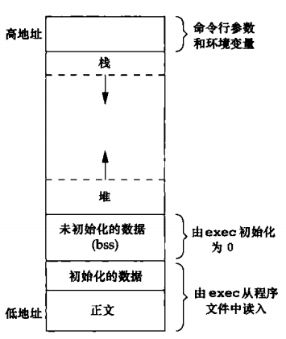

C程序由下列几部分组成：



- 正文段。这是由CPU执行的机器指令部分。通常，正文段是可共享的，所以即使是频繁执行的程序（如文本编辑器、C编译器和shell等）在存储器中也只需有一个副本，另外，正文段常常是只读的，以防止程序由于意外而修改其指令。

- 初始化数据段。通常将此段称为数据段，它包含了程序中需明确地赋初值的变量。例如，C程序中任何函数之外的声明：

```C
int maxcount=99；
```
使此变量以其初值存放在初始化数据段中。

- 未初始化数据段。通常将此段称为bss段，这一名称来源于早期汇编程序一个操作符，意思是“由符号开始的块”（block started by symbol），在程序开始执行之前，内核将此段中的数据初始化为0或空指针。函数外的声明：

```C
// 使此变量存放在非初始化数据段中。
1ong sum[1000]；
```


- 栈。自动变量以及每次函数调用时所需保存的信息都存放在此段中。每次函数调用时，其返回地址以及调用者的环境信息（如某些机器寄存器的值）都存放在栈中。然后，最近被调用的函数在栈上为其自动和临时变量分配存储空间。通过以这种方式使用栈，C递归函数可以工作。递归函数每次调用自身时，就用一个新的栈帧，因此一次函数调用实例中的变量集不会影响另一次函数调用实例中的变量。

- 堆。通常在堆中进行动态存储分配。

未初始化数据段的内容并不存放在磁盘程序文件中。其原因是，内核在程序开始运行前将它们都设置为0。**需要存放在磁盘程序文件中的段只有正文段和初始化数据段。**

**最后介绍一个命令**，
size(1) 命令可以查看一个可执行正文段、数据段和bss段的长度（以字节为单位）。

