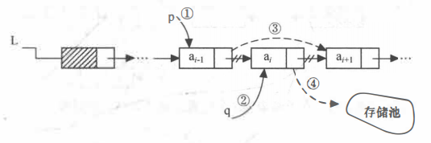

线性表链式存储结构的特点是：用一组任意的存储单元存储线性表的数据元素（这组存储单元可以是连续的，也可以是不连续的）。 

链表由n个结点链结成，结点包括两个域：其中存储数据元素信息的域称为数据域；存储直接后继存储位置的域称为指针域。

又由于此链表的每个结点中只包含一个指针域，故又称线性链表或单链表。

用单链表表示线性表时，数据元素之间的逻辑关系是由结点中的指针指示的。换句话说，指针为数据元素之间的逻辑关系的映像，则逻辑上相邻的两个数据元素其存储的物理位置不要求紧邻，由此，这种存储结构为非顺序映像或链式映像。

链表的存取必须从头指针开始进行，头指针指示链表中第一个结点（即第一个数据元素的存储映像，也称首元结点）的存储位置。

在使用链表时，关心的只是它所表示的线性表中数据元素之间的逻辑顺序，而不是每个数据元素在存储器中的实际位置。

下面结合PG代码中的单链表介绍具体的实现。

## 定义链表结点

```C
/*
这里定义的是单链表中每个结点的 存储结构，它包括两部分：
1、存储结点的数据域 data, 其类型 用联合体union表示，可以为指针类型，整型，Oid类型；
2、存储后继结点位置的指针域 next, 其类型为指向结点的指针类型 ListCell *。

*/
struct ListCell
{
	union
	{
		void	   *ptr_value;
		int			int_value;
		Oid			oid_value;
	}			data;
	ListCell   *next;
};
```

## 定义头结点
一般情况下，为了处理方便，在单链表的第一个结点之前附设一个结点，称之为头结点。

头结点存储与链表类型，长度，头结点，尾结点等其他附加信息，方便对链表的管理。
```C
typedef struct List
{
	NodeTag		type;			/* 链表的类型：T_List, T_IntList, or T_OidList */
	int			length;         /* 链表的长度 */
	ListCell   *head;           /* 指向链表的头部 */
	ListCell   *tail;           /* 指向链表的尾部 */
} List;
```

## 单链表的初始化
【算法步骤】

	1、生成新结点，指针域置空。
	2、再创建一个头结点，头结点的head和tail都指向新创建的链表节点，并设置链表类型，长度。

```C
/*
 * Return a freshly allocated List. Since empty non-NIL lists are
 * invalid, new_list() also allocates the head cell of the new list:
 * the caller should be sure to fill in that cell's data.
 */
static List *
new_list(NodeTag type)
{
	List	   *new_list;
	ListCell   *new_head;

	new_head = (ListCell *) palloc(sizeof(*new_head));
	new_head->next = NULL;
	/* new_head->data is left undefined! */

	new_list = (List *) palloc(sizeof(*new_list));
	new_list->type = type;
	new_list->length = 1;
	new_list->head = new_head;
	new_list->tail = new_head;

	return new_list;
}
```


## 尾部插入
创建一个新的节点，并插入链表尾部，然后对新节点的数据赋值。
```C
/*
 * Allocate a new cell and make it the tail of the specified
 * list. Assumes the list it is passed is non-NIL.
 *
 * The data in the new tail cell is undefined; the caller should be
 * sure to fill it in
 */
static void
new_tail_cell(List *list)
{
	ListCell   *new_tail;

	new_tail = (ListCell *) palloc(sizeof(*new_tail));
	new_tail->next = NULL;

	list->tail->next = new_tail;
	list->tail = new_tail;
	list->length++;
}

/*
 * Append a pointer to the list. A pointer to the modified list is
 * returned. Note that this function may or may not destructively
 * modify the list; callers should always use this function's return
 * value, rather than continuing to use the pointer passed as the
 * first argument.
 */
List *
lappend(List *list, void *datum)
{
	// ((list) == NIL || IsA((listl), List))
	Assert(IsPointerList(list));

	if (list == NIL)
		list = new_list(T_List);
	else
		new_tail_cell(list);

	// #define lfirst(lc) ((lc)->data.ptr_value)
	lfirst(list->tail) = datum;
	check_list_invariants(list);
	return list;
}


```

## 头部插入

```C
/*
 * Allocate a new cell and make it the head of the specified
 * list. Assumes the list it is passed is non-NIL.
 *
 * The data in the new head cell is undefined; the caller should be
 * sure to fill it in
 */
static void
new_head_cell(List *list)
{
	ListCell   *new_head;

	new_head = (ListCell *) palloc(sizeof(*new_head));
	new_head->next = list->head;

	list->head = new_head;
	list->length++;
}

List *
lcons(void *datum, List *list)
{
	Assert(IsPointerList(list));

	if (list == NIL)
		list = new_list(T_List);
	else
		new_head_cell(list);

	lfirst(list->head) = datum;
	check_list_invariants(list);
	return list;
}
```

## 删除结点

```C
/*
 * Delete the first cell in list that matches datum, if any.
 * Equality is determined via equal().
 */
List *
list_delete(List *list, void *datum)
{
	ListCell   *cell;
	ListCell   *prev;

	Assert(IsPointerList(list));
	check_list_invariants(list);

	prev = NULL;
	foreach(cell, list)
	{
		if (equal(lfirst(cell), datum))
			return list_delete_cell(list, cell, prev);

		prev = cell;
	}

	/* Didn't find a match: return the list unmodified */
	return list;
}

/*
 * Delete 'cell' from 'list'; 'prev' is the previous element to 'cell'
 * in 'list', if any (i.e. prev == NULL iff list->head == cell)
 *
 * The cell is pfree'd, as is the List header if this was the last member.
 */
List *
list_delete_cell(List *list, ListCell *cell, ListCell *prev)
{
	check_list_invariants(list);
	Assert(prev != NULL ? lnext(prev) == cell : list_head(list) == cell);

	/*
	 * If we're about to delete the last node from the list, free the whole
	 * list instead and return NIL, which is the only valid representation of
	 * a zero-length list.
	 */
	if (list->length == 1)
	{
		list_free(list);
		return NIL;
	}

	/*
	 * Otherwise, adjust the necessary list links, deallocate the particular
	 * node we have just removed, and return the list we were given.
	 */
	list->length--;

	if (prev)
		prev->next = cell->next;
	else
		list->head = cell->next;

	if (list->tail == cell)
		list->tail = prev;

	pfree(cell);
	return list;
}

```
单链表的删除算法步骤:

删除单链表的第i个结点ai的具体过程如图所示，图中的对应的4个步骤说明如下。
1. 查找结点ai-1 并由指针p指向该结点。
2. 临时保存待删除结点ai的地址在q中，以备释放。
3. 将结点*p的指针域指向ai的直接后继结点。
4. 释放结点ai的空间。



考虑特殊情况：
如果删除的头结点，则将head指针指向q->next；
如果删除的是尾部结点，则将 tail 指针指向 p；


