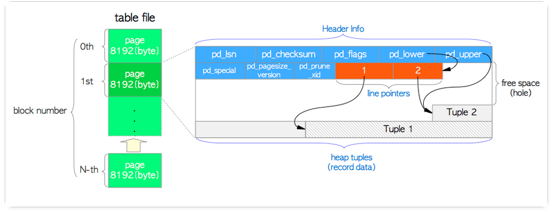

在PostgreSQL中，表存储在堆文件中，这些文件采用分槽的页（slotted-page）格式，该结构便于存储变长记录。



在每一页中包含了三种类型的数据：

1. 头数据——由PageHeaderData结构定义的头数据分配在页面的开头。它是24字节长，包含有关页面的常规信息。
```C
typedef struct PageHeaderData
{
	/* XXX LSN is member of *any* block, not only page-organized ones */
	PageXLogRecPtr pd_lsn;		/* LSN: next byte after last byte of xlog
								 * record for last change to this page */
	uint16		pd_checksum;	/* checksum */
	uint16		pd_flags;		/* flag bits, see below */
	LocationIndex pd_lower;		/* offset to start of free space */
	LocationIndex pd_upper;		/* offset to end of free space */
	LocationIndex pd_special;	/* offset to start of special space */
	uint16		pd_pagesize_version;
	TransactionId pd_prune_xid; /* oldest prunable XID, or zero if none */
	ItemIdData	pd_linp[FLEXIBLE_ARRAY_MEMBER]; /* line pointer array */
} PageHeaderData;
```
   结构的主要变量描述如下：

    pd_lsn——此变量存储由该页面的最后更改写入的XLOG记录的LSN。它是一个8字节无符号整数。

    pd_checksum——此变量存储此页面的校验和值。

    pd_lower，pd_upper——pd_lower指向行指针的末尾，而pd_upper指向最新堆元组的开始。

    pd_special——此变量用于索引。在表内的页面中，它指向页面的末尾。（在索引内的页面中，它指向特殊空间的开始，该空间是仅由索引保存的数据区域，并根据诸如B树，GiST，GiN等索引类型的类型包含特定数据。）

2. 头部数据后都跟一组“行指针”。行指针的长度为4个字节，一个行指针存储了该页中一个特定元组的偏移量（相对于每一页的开始位置）和长度。
```C
typedef struct ItemIdData
{
	unsigned	lp_off:15,		/* offset to tuple (from start of page) */
				lp_flags:2,		/* state of line pointer, see below */
				lp_len:15;		/* byte length of tuple */
} ItemIdData;
```

3. 实际的元组是从每一页末尾开始连续排列，以与行指针相反的顺序存储。块中空闲空间是连续的，在行指针的末尾和最新一条记录之间。当将新的元组添加到页面时，新的行指针也被推到数组上以指向新的元组。


如果一条记录被删除，它的条目被设置成被删除状态（例如这条记录的大小被设置为-1）。此外，由删除而产生的空闲空间被重用，并且所有空闲空间仍然存在于行指针数组的最后一个条目和最新记录之间。空闲空间指针pd_lower，pd_upper也要做适当修改。只要块中有空间，使用类似的技术可以使记录增长或缩短。移动记录的代价并不高，因为块的大小是有限制的：默认为8KB。

尽管这种架构允许向一页中添加或删除元组，基于PostgreSQL的MVCC方式，这些操作都不会真正地立即删除或替换行的旧版本。过期元组可以通过之后的命令来物理删除，从而在该页中形成空洞。通过行指针数组来间接访问元组的策略使得这些空洞可以重用。

分槽的页结构要求指针不是直接指向记录，而是指向块头中记有记录实际位置的ItemIdData。在支持指向记录的间接指针的同时，这种间接层次允许移动记录以防止在块的内部出现碎片空间。


大多数关系数据库限制记录不大于一个块的大小，这样可以简化缓冲区管理和空闲空间管理。大对象常常存储到一个特殊文件（或文件的集合）中而不是与记录的其他（短）属性存储在一起。然后一个指向该对象的（逻辑）指针存储到包含该大对象的记录中。

PostgreSQL遇到如此大的元组时，使用称为TOAST（The Oversized-Attribute Storage Technique）的方法来存储和管理大于2 KB（约8 KB的1/4）的堆元组。它尽力“缩减”单个的大属性。在有些情况下，缩减一个属性可能通过对值的压缩来实现。如果这还不足以使元组缩减到可以放入页中（通常的情况），则被缩减属性中的数据被一个引用所取代，它指向数据在该页之外的拷贝存储。