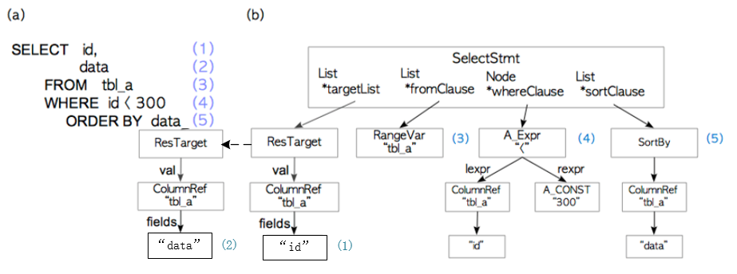

SQL语句的执行经过词法分析、语法分析生成语法树，再经过语义分析会生成查询树，函数调用流程如下：
```C
exec_simple_query
    |-> pg_parse_query  --> 生成语法树，返回raw_parsetree_list
        |-> raw_parser
    |-> pg_analyze_and_rewrite  --> 
        |-> parse_analyze       --> 语义分析
        |-> pg_rewrite_query    --> 查询重写
```
1. pg_parse_query函数调用raw_parser函数，生成语法树，通过raw_parsetree_list链表返回；
2. pg_analyze_and_rewrite函数先调用parse_analyze对上面生成的语法树进行语义分析，生成查询树（Query结构体），再调用pg_rewrite_query对查询树进行重写；

 
raw_parser通过调用flex词法分析工具、bison语法分析工具生成的C代码具有词法、语法分析功能，最后生成语法树。

flex通过“.l”文件中定义的正则表达式对字符进行模式匹配，从而实现词法分析；

bison对flex匹配到的字符尝试再去匹配一个特定的语法结构，这些语法定义写在“.y”的文件中。

PG中的“.l”和“.y”文件分别是scan.l和gram.y，在编译PG的时候会生成scan.c和gram.c两个文件。

## select实例
SQL的语法分析是将语句拆分成很多小的语法单元，然后分别对这些小的语法单元进行分析。搞清楚了各个小语法单元的实现，就可以将它们组合在一起形成整个语法树。

```sql
postgres=# SELECT id, data FROM tbl_a WHERE id < 300 ORDER BY data;
```
以上面的SQL语句为例，介绍语法树的生成过程。


select语法在gram.y中定义如下：
```C
// SELECT 语句通过标识符SelectStmt表示，定义为带括号的SELECT语句（用标识符 select_with_parens 表示）和不带括号的SELECT语句（用标识符select_no_parens表示）

SelectStmt: select_no_parens			%prec UMINUS
			| select_with_parens		%prec UMINUS
		;

// 带括号的SELECT语句最终会定义为括号和不带括号的SELECT语句来处理
// 因此最终要处理的是不带括号的形式

select_with_parens:
			'(' select_no_parens ')'				{ $$ = $2; }
			| '(' select_with_parens ')'			{ $$ = $2; }
		;

// 不带括号的SELECT语句可以定义为一条简单的SELECT语句（用标识符simple_select表示），也可以定义为在SELECT后接排序子句（用标识符sort_clause表示）等构成的复杂语句。

// 本例子中select语句匹配simple_select的语法定义。
select_no_parens:
			simple_select						{ $$ = $1; }
			| select_clause sort_clause
				{
					insertSelectOptions((SelectStmt *) $1, $2, NIL,
										NULL, NULL, NULL,
										yyscanner);
					$$ = $1;
				}
		.......
		;

select_clause:
			simple_select							{ $$ = $1; }
			| select_with_parens					{ $$ = $1; }
		;

// simple_select由如下子句组成：去除行重复的DISTINCT（标识符opt_distinct）、目标属性（标识符target_list）、SELECT INTO子句（标识符into_clause）、FROM子句（标识符from_clause）、WHERE子句（标识符where_clause）、GROUP BY子句（标识符group_clause）、HAVING子句（标识符having_clause）和窗口子句（标识符window_clause）。

// 在匹配simple_select 语法结构后，将创建一个SelectStmt结构体，并将各子句赋值到结构体中相应的字段。
simple_select:
			SELECT opt_all_clause opt_target_list
			into_clause from_clause where_clause
			group_clause having_clause window_clause
				{
					SelectStmt *n = makeNode(SelectStmt);
					n->targetList = $3;
					n->intoClause = $4;
					n->fromClause = $5;
					n->whereClause = $6;
					n->groupClause = $7;
					n->havingClause = $8;
					n->windowClause = $9;
					$$ = (Node *)n;
				}
			| SELECT distinct_clause target_list
			into_clause from_clause where_clause
			group_clause having_clause window_clause
				{
					SelectStmt *n = makeNode(SelectStmt);
					n->distinctClause = $2;
					n->targetList = $3;
					n->intoClause = $4;
					n->fromClause = $5;
					n->whereClause = $6;
					n->groupClause = $7;
					n->havingClause = $8;
					n->windowClause = $9;
					$$ = (Node *)n;
				}
			| values_clause							{ $$ = $1; }
			| TABLE relation_expr
				{
					/* same as SELECT * FROM relation_expr */
					ColumnRef *cr = makeNode(ColumnRef);
					ResTarget *rt = makeNode(ResTarget);
					SelectStmt *n = makeNode(SelectStmt);

					cr->fields = list_make1(makeNode(A_Star));
					cr->location = -1;

					rt->name = NULL;
					rt->indirection = NIL;
					rt->val = (Node *)cr;
					rt->location = -1;

					n->targetList = list_make1(rt);
					n->fromClause = list_make1($2);
					$$ = (Node *)n;
				}
			| select_clause UNION all_or_distinct select_clause
				{
					$$ = makeSetOp(SETOP_UNION, $3, $1, $4);
				}
			| select_clause INTERSECT all_or_distinct select_clause
				{
					$$ = makeSetOp(SETOP_INTERSECT, $3, $1, $4);
				}
			| select_clause EXCEPT all_or_distinct select_clause
				{
					$$ = makeSetOp(SETOP_EXCEPT, $3, $1, $4);
				}
		;
```

SelectStmt结构体定义如下。

```C
typedef struct SelectStmt
{
	NodeTag		type;

	/*
	 * These fields are used only in "leaf" SelectStmts.
	 */
	List	   *distinctClause; /* NULL, list of DISTINCT ON exprs, or
								 * lcons(NIL,NIL) for all (SELECT DISTINCT) */
	IntoClause *intoClause;		/* target for SELECT INTO */
	List	   *targetList;		/* the target list (of ResTarget) */
	List	   *fromClause;		/* the FROM clause */
	Node	   *whereClause;	/* WHERE qualification */
	List	   *groupClause;	/* GROUP BY clauses */
	Node	   *havingClause;	/* HAVING conditional-expression */
	List	   *windowClause;	/* WINDOW window_name AS (...), ... */

	/*
	 * In a "leaf" node representing a VALUES list, the above fields are all
	 * null, and instead this field is set.  Note that the elements of the
	 * sublists are just expressions, without ResTarget decoration. Also note
	 * that a list element can be DEFAULT (represented as a SetToDefault
	 * node), regardless of the context of the VALUES list. It's up to parse
	 * analysis to reject that where not valid.
	 */
	List	   *valuesLists;	/* untransformed list of expression lists */

	/*
	 * These fields are used in both "leaf" SelectStmts and upper-level
	 * SelectStmts.
	 */
	List	   *sortClause;		/* sort clause (a list of SortBy's) */
	Node	   *limitOffset;	/* # of result tuples to skip */
	Node	   *limitCount;		/* # of result tuples to return */
	List	   *lockingClause;	/* FOR UPDATE (list of LockingClause's) */
	WithClause *withClause;		/* WITH clause */

	/*
	 * These fields are used only in upper-level SelectStmts.
	 */
	SetOperation op;			/* type of set op */
	bool		all;			/* ALL specified? */
	struct SelectStmt *larg;	/* left child */
	struct SelectStmt *rarg;	/* right child */
	/* Eventually add fields for CORRESPONDING spec here */
} SelectStmt;
```

下面对实例中的select语句在SelectStmt结构体中的对应关系进行介绍。

### opt_all_clause

```C
// 本select语句中匹配为空
opt_all_clause:
			ALL										{ $$ = NIL;}
			| /*EMPTY*/								{ $$ = NIL; }
		;
```

### target_list
实例中id, data字段对应target_list，target_list可以由若干个target_el组成，通过逗号分隔。

```C
// 匹配到target_list
opt_target_list: target_list						{ $$ = $1; }
			| /* EMPTY */							{ $$ = NIL; }
		;

// target_list由若干个target_el组成，通过逗号分隔。
target_list:
			target_el								{ $$ = list_make1($1); }
			| target_list ',' target_el				{ $$ = lappend($1, $3); }
		;

// target_el定义为取别名的表达式、表达式以及“*”等.
// 本实例将匹配到表达式（a_expr标识）
target_el:	a_expr AS ColLabel
				{
					$$ = makeNode(ResTarget);
					$$->name = $3;
					$$->indirection = NIL;
					$$->val = (Node *)$1;
					$$->location = @1;
				}
			/*
			 * We support omitting AS only for column labels that aren't
			 * any known keyword.  There is an ambiguity against postfix
			 * operators: is "a ! b" an infix expression, or a postfix
			 * expression and a column label?  We prefer to resolve this
			 * as an infix expression, which we accomplish by assigning
			 * IDENT a precedence higher than POSTFIXOP.
			 */
			| a_expr IDENT
				{
					$$ = makeNode(ResTarget);
					$$->name = $2;
					$$->indirection = NIL;
					$$->val = (Node *)$1;
					$$->location = @1;
				}
			
			// 匹配到a_expr时，将创建一个ResTarget结构体，该结构体中存储了该属性的全部信息。
			| a_expr
				{
					$$ = makeNode(ResTarget);
					$$->name = NULL;
					$$->indirection = NIL;
					$$->val = (Node *)$1;
					$$->location = @1;
				}
			| '*'
				{
					ColumnRef *n = makeNode(ColumnRef);
					n->fields = list_make1(makeNode(A_Star));
					n->location = @1;

					$$ = makeNode(ResTarget);
					$$->name = NULL;
					$$->indirection = NIL;
					$$->val = (Node *)n;
					$$->location = @1;
				}
		;

// 上面 $$->val = (Node *)$1 --> $$->val = (Node *)a_expr，通过递归定义。
// a_expr --> c_expr
a_expr:		c_expr									{ $$ = $1; }
			| ......
			
	    ;

// c_expr --> columnref
c_expr:		columnref								{ $$ = $1; }
			| ......
			
		;
// columnref --> ColId，创建 ColumnRef 结构体。
// 因此，$$->val = (Node *)$1 --> $$->val = (Node *)a_expr --> $$->val = (Node *)c_expr --> $$->val = (Node *)columnref  --> $$->val = (Node *)ColId --> $$->val = (Node *)ColumnRef --> ResTarget->val = (Node *)ColumnRef
// 最终，ResTarget 结构体中的val成员指向 ColumnRef 结构体
columnref:	ColId
				{
					$$ = makeColumnRef($1, NIL, @1, yyscanner);
				}
			| ColId indirection
				{
					$$ = makeColumnRef($1, $2, @1, yyscanner);
				}
		;	

// 创建 ColumnRef 结构，将结构体里 fields 字段赋值为 select 查询中具体的目标字段。	
static Node *
makeColumnRef(char *colname, List *indirection,
			  int location, core_yyscan_t yyscanner)
{
	/*
	 * Generate a ColumnRef node, with an A_Indirection node added if there
	 * is any subscripting in the specified indirection list.  However,
	 * any field selection at the start of the indirection list must be
	 * transposed into the "fields" part of the ColumnRef node.
	 */
	ColumnRef  *c = makeNode(ColumnRef);
	int		nfields = 0;
	ListCell *l;

	c->location = location;
	foreach(l, indirection)
	{
		if (IsA(lfirst(l), A_Indices))
		{
			A_Indirection *i = makeNode(A_Indirection);

			if (nfields == 0)
			{
				/* easy case - all indirection goes to A_Indirection */
				c->fields = list_make1(makeString(colname));
				i->indirection = check_indirection(indirection, yyscanner);
			}
			else
			{
				/* got to split the list in two */
				i->indirection = check_indirection(list_copy_tail(indirection,
																  nfields),
												   yyscanner);
				indirection = list_truncate(indirection, nfields);
				c->fields = lcons(makeString(colname), indirection);
			}
			i->arg = (Node *) c;
			return (Node *) i;
		}
		else if (IsA(lfirst(l), A_Star))
		{
			/* We only allow '*' at the end of a ColumnRef */
			if (lnext(l) != NULL)
				parser_yyerror("improper use of \"*\"");
		}
		nfields++;
	}
	/* No subscripting, so all indirection gets added to field list */
	c->fields = lcons(makeString(colname), indirection);
	return (Node *) c;
}
```

ResTarget结构体定义：
```C
typedef struct ResTarget
{
	NodeTag		type;
	char	   *name;			/* column name or NULL */
	List	   *indirection;	/* subscripts, field names, and '*', or NIL */
	Node	   *val;			/* the value expression to compute or assign */
	int			location;		/* token location, or -1 if unknown */
} ResTarget;
```

ColumnRef结构体定义：

```C
typedef struct ColumnRef
{
	NodeTag		type;
	List	   *fields;			/* field names (Value strings) or A_Star */
	int			location;		/* token location, or -1 if unknown */
} ColumnRef;
```

### into_clause
该select实例中没有into语句，所以匹配为空。
```C
into_clause:
			INTO OptTempTableName
				{
					$$ = makeNode(IntoClause);
					$$->rel = $2;
					$$->colNames = NIL;
					$$->options = NIL;
					$$->onCommit = ONCOMMIT_NOOP;
					$$->tableSpaceName = NULL;
					$$->viewQuery = NULL;
					$$->skipData = false;
				}
			| /*EMPTY*/
				{ $$ = NULL; }
		;
```

### from_clause

```C
// SELECT语句中的FROM子句对应from_clause标识，from_clause由FROM 关键字和from_Jist组成。
// from_clause --> from_list
from_clause:
			FROM from_list							{ $$ = $2; }
			| /*EMPTY*/								{ $$ = NIL; }
		;

// from_list由若干个标识符table_ref组成，逗号分隔每个子项，表示在FROM子句中出现的多个表或者多个子查询。
// from_list --> table_ref
from_list:
			table_ref								{ $$ = list_make1($1); }
			| from_list ',' table_ref				{ $$ = lappend($1, $3); }
		;

// table_ref可以定义为关系表达式、取别名的关系表达式、表连接等形式。
// table_ref --> relation_expr opt_alias_clause
// table_ref = (Node *) relation_expr;
table_ref:	relation_expr opt_alias_clause
				{
					$1->alias = $2;
					$$ = (Node *) $1;
				}
			| relation_expr opt_alias_clause tablesample_clause
				{
					…………
				}
			| func_table func_alias_clause
				{
					…………
				}
			| joined_table
				{
					…………
				}
                .......
		;

// 本例子中，relation_expr定义成qualified_name
// relation_expr -- > qualified_name
// table_ref = (Node *) qualified_name;
relation_expr:
			qualified_name
				{
					/* inheritance query, implicitly */
					$$ = $1;
					$$->inh = true;
					$$->alias = NULL;
				}
			| qualified_name '*'
				{
					/* inheritance query, explicitly */
					$$ = $1;
					$$->inh = true;
					$$->alias = NULL;
				}
			| ONLY qualified_name
				{
					/* no inheritance */
					$$ = $2;
					$$->inh = false;
					$$->alias = NULL;
				}
			| ONLY '(' qualified_name ')'
				{
					/* no inheritance, SQL99-style syntax */
					$$ = $3;
					$$->inh = false;
					$$->alias = NULL;
				}
		;

// 本例中，qualified_name 定义成ColId。匹配后，创建一个RangeVar结构体用来存储该表的信息。	
// qualified_name --> ColId
// table_ref = (Node *) RangeVar;
qualified_name:
			ColId
				{
					$$ = makeRangeVar(NULL, $1, @1);
				}
			| ColId indirection
		    	…………
		;
// 本例中，匹配为空。
opt_alias_clause: alias_clause						{ $$ = $1; }
			| /*EMPTY*/								{ $$ = NULL; }
		;

// 最终，from_list = (Node *) RangeVar;
// 将表名（ColId）赋值给结构体RangeVar中的relname
```

makeRangeVar函数创建一个RangeVar结构体：
```C
RangeVar *
makeRangeVar(char *schemaname, char *relname, int location)
{
	RangeVar   *r = makeNode(RangeVar);

	r->catalogname = NULL;
	r->schemaname = schemaname;
	r->relname = relname;
	r->inh = true;
	r->relpersistence = RELPERSISTENCE_PERMANENT;
	r->alias = NULL;
	r->location = location;

	return r;
}
```
RangeVar结构体定义如下：

```C
typedef struct RangeVar
{
	NodeTag		type;
	char	   *catalogname;	/* the catalog (database) name, or NULL */
	char	   *schemaname;		/* the schema name, or NULL */
	char	   *relname;		/* the relation/sequence name */
	bool		inh;			/* expand rel by inheritance? recursively act
								 * on children? */
	char		relpersistence; /* see RELPERSISTENCE_* in pg_class.h */
	Alias	   *alias;			/* table alias & optional column aliases */
	int			location;		/* token location, or -1 if unknown */
} RangeVar;
```

### where_clause

```C
// WHERE子句对应着语法定义中的where_clause标识符，由关键字WHERE和一个表达式（标识符a_expr）组成。
where_clause:
			WHERE a_expr							{ $$ = $2; }
			| /*EMPTY*/								{ $$ = NULL; }
		;

// 本例中，a_expr '<' a_expr --> c_expr '<' c_expr
a_expr:		c_expr									{ $$ = $1; }
            | a_expr '<' a_expr
				{ $$ = (Node *) makeSimpleA_Expr(AEXPR_OP, "<", $1, $3, @2); }
			|......
		；

// 该select例子，WHERE id < 300
// id --> columnref
// 300 --> AexprConst
c_expr:		columnref								{ $$ = $1; }
			| AexprConst							{ $$ = $1; }
			.......
		;

// id --> ColumnRef结构体
columnref:	ColId
				{
					$$ = makeColumnRef($1, NIL, @1, yyscanner);
				}
			| ColId indirection
				{
					$$ = makeColumnRef($1, $2, @1, yyscanner);
				}
		;

// 300 --> 	A_Const结构体
AexprConst: Iconst
				{
					$$ = makeIntConst($1, @1);
				}
			| FCONST
				{
					$$ = makeFloatConst($1, @1);
				}
			| Sconst
				{
					$$ = makeStringConst($1, @1);
				}
			......
		;
		
static Node *
makeIntConst(int val, int location)
{
	A_Const *n = makeNode(A_Const);

	n->val.type = T_Integer;
	n->val.val.ival = val;
	n->location = location;

	return (Node *)n;
}
```

该例select语句中where字句匹配：a_expr '<' a_expr，将调用makeSimpleA_Expr函数，创建A_Expr结构体，并对操作符名，左表达式，右表达式等成员变量赋值。lexpr指向ColumnRef结构体，rexpr指向A_Const结构体，A_Expr_Kind代表"<"操作：
```C
A_Expr *
makeSimpleA_Expr(A_Expr_Kind kind, char *name,
				 Node *lexpr, Node *rexpr, int location)
{
	A_Expr	   *a = makeNode(A_Expr);

	a->kind = kind;
	a->name = list_make1(makeString((char *) name));
	a->lexpr = lexpr;
	a->rexpr = rexpr;
	a->location = location;
	return a;
}
```
A_Expr结构体定义：

```C
typedef struct A_Expr
{
	NodeTag		type;
	A_Expr_Kind kind;			/* see above */
	List	   *name;			/* possibly-qualified name of operator */
	Node	   *lexpr;			/* left argument, or NULL if none */
	Node	   *rexpr;			/* right argument, or NULL if none */
	int			location;		/* token location, or -1 if unknown */
} A_Expr;
```

### group_clause
该例子中没有group by子句，所以匹配为空。
```C
group_clause:
			GROUP_P BY group_by_list				{ $$ = $3; }
			| /*EMPTY*/								{ $$ = NIL; }
```

### having_clause
该例子中没有having子句，所以匹配为空。

```C
having_clause:
			HAVING a_expr							{ $$ = $2; }
			| /*EMPTY*/								{ $$ = NULL; }
		;
```

### sort_clause

```C
// ORDER BY子句对应于sort_clause标识符，由关键字 "ORDER BY" 和 sortby_list 标识符组成。
sort_clause:
			ORDER BY sortby_list					{ $$ = $3; }
		;

// sortby_list 由多个 sortby 组成。
sortby_list:
			sortby									{ $$ = list_make1($1); }
			| sortby_list ',' sortby				{ $$ = lappend($1, $3); }
		;

// sortby --> a_expr opt_asc_desc opt_nulls_order
// 创建 SortBy 结构体，并对结构体中的node赋值为 ColumnRef 结构体
sortby:		a_expr USING qual_all_Op opt_nulls_order
				{
					$$ = makeNode(SortBy);
					$$->node = $1;
					$$->sortby_dir = SORTBY_USING;
					$$->sortby_nulls = $4;
					$$->useOp = $3;
					$$->location = @3;
				}
			| a_expr opt_asc_desc opt_nulls_order
				{
					$$ = makeNode(SortBy);
					$$->node = $1;
					$$->sortby_dir = $2;
					$$->sortby_nulls = $3;
					$$->useOp = NIL;
					$$->location = -1;		/* no operator */
				}
		;

// a_expr --> a_expr
a_expr:		c_expr									{ $$ = $1; }
            ......
		；

// c_expr --> columnref
c_expr:		columnref								{ $$ = $1; }
			.......
		;

// a_expr --> ColumnRef
columnref:	ColId
				{
					$$ = makeColumnRef($1, NIL, @1, yyscanner);
				}
			.......
		;
 // opt_asc_desc --> 空
opt_asc_desc: ASC							{ $$ = SORTBY_ASC; }
			| DESC							{ $$ = SORTBY_DESC; }
			| /*EMPTY*/						{ $$ = SORTBY_DEFAULT; }
		;

// opt_nulls_order --> 空
opt_nulls_order: NULLS_LA FIRST_P			{ $$ = SORTBY_NULLS_FIRST; }
			| NULLS_LA LAST_P				{ $$ = SORTBY_NULLS_LAST; }
			| /*EMPTY*/						{ $$ = SORTBY_NULLS_DEFAULT; }
		;
	

```

SortBy结构体定义：
```C
typedef struct SortBy
{
	NodeTag		type;
	Node	   *node;			/* expression to sort on */
	SortByDir	sortby_dir;		/* ASC/DESC/USING/default */
	SortByNulls sortby_nulls;	/* NULLS FIRST/LAST */
	List	   *useOp;			/* name of op to use, if SORTBY_USING */
	int			location;		/* operator location, or -1 if none/unknown */
} SortBy;
```
### 最终语法树


最终执行后的语法树生成如下（RawStmt结构体，包含了SelectStmt结构体，即语法树的主体）
```C
{RAWSTMT
:stmt 
{SELECT
	:distinctClause <>
	:intoClause <>
	:targetList (
		{RESTARGET
		:name <>
		:indirection <>
		:val 
			{COLUMNREF
			:fields (\"id\")
			:location 7}
		:location 7} 		
		{RESTARGET
		:name <>
		:indirection <>
		:val 
			{COLUMNREF
			:fields (\"data\")
			:location 11}
		:location 11})
	:fromClause (
		{RANGEVAR
		:schemaname <>
		:relname tbl_a
		:inh true
		:relpersistence p
		:alias <>
		:location 21})
	:whereClause 
		{AEXPR 
		:name (\"\\<\")
		:lexpr 
			{COLUMNREF
			:fields (\"id\")
			:location 33}
		:rexpr 
			{A_CONST
			:val 300
			:location 38}
		:location 36}
	:groupClause <>
	:havingClause <>
	:windowClause <>
	:valuesLists <>
	:sortClause (
		{SORTBY
		:node 
			{COLUMNREF
			:fields (\"data\")
			:location 51}
		:sortby_dir 0
		:sortby_nulls 0
		:useOp <>
		:location -1})
	:limitOffset <>
	:limitCount <>
	:lockingClause <>
	:withClause <>
	:op 0
	:all false
	:larg <>
	:rarg <>} 
:stmt_location 0 
:stmt_len 55
}
```
