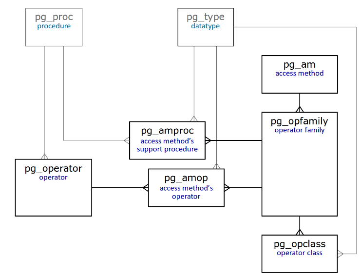

在第一篇文章中，我们提到了访问方法必须提供有关其自身的信息。让我们看一下访问方法接口的结构。

# 属性

访问方法的所有属性都存储在“pg_am”表中（“am”：access method）。我们还可以从同一张表中获得可用方法的列表：


```SQL
postgres=# select amname from pg_am;
 amname
--------
 btree
 hash
 gist
 gin
 spgist
 brin
(6 rows)
```


尽管可以正确地将顺序扫描称为访问方法，但是由于历史原因，它不在此列表中。

在PostgreSQL 9.5和更低的版本中，每个属性都由«pg_am»表的单独字段表示。从9.6版开始，使用特殊函数查询属性，并将其分为几层：

- 访问方法属性—«pg_indexam_has_property»
- 特定索引的属性—«pg_index_has_property»
- 索引各列的属性—«pg_index_column_has_property»

以后，访问方法层和索引层将是分开的：到目前为止，所有基于一种访问方法的索引将始终具有相同的属性。

以下四个属性是访问方法的属性（以«btree»为例）：


```SQL
postgres=# select a.amname, p.name, pg_indexam_has_property(a.oid,p.name)
            from pg_am a,
            unnest(array['can_order','can_unique','can_multi_col','can_exclude']) p(name)
            where a.amname = 'btree'
            order by a.amname;
 amname |     name      | pg_indexam_has_property
--------+---------------+-------------------------
 btree  | can_order     | t
 btree  | can_unique    | t
 btree  | can_multi_col | t
 btree  | can_exclude   | t
(4 rows)
```


- can_order。
访问方法使我们能够在创建索引时指定值的排序顺序（到目前为止仅适用于“ btree”）。
- can_unique。
支持唯一约束和主键（仅适用于“ btree”）。
- can_multi_col。
索引可以建立在几列上。
- can_exclude。
支持排除约束EXCLUDE。

以下属性与索引有关（例如，让我们考虑现有索引）：


```SQL
postgres=# select p.name, pg_index_has_property('t_a_idx'::regclass,p.name)
           from unnest(array['clusterable','index_scan','bitmap_scan','backward_scan']) p(name);
     name      | pg_index_has_property
---------------+-----------------------
 clusterable   | t
 index_scan    | t
 bitmap_scan   | t
 backward_scan | t
(4 rows)
```


- clusterable。
可以根据索引对行进行重新排序（使用同名命令CLUSTER进行聚集）。
- index_scan。
虽然这个属性看起来很奇怪，但并不是所有索引都可以逐个返回tid——有些索引一次返回所有结果，并且只支持位图扫描。
- bitmap_scan。
支持位图扫描。
- backward_scan。
可以按建立索引时指定的相反顺序返回结果。

最后，以下是列属性：


```SQL
postgres=# select p.name, pg_index_column_has_property('t_a_idx'::regclass,1,p.name)
			from unnest(array[
			'asc','desc','nulls_first','nulls_last','orderable','distance_orderable',
			'returnable','search_array','search_nulls'
			]) p(name);
        name        | pg_index_column_has_property
--------------------+------------------------------
 asc                | t
 desc               | f
 nulls_first        | f
 nulls_last         | t
 orderable          | t
 distance_orderable | f
 returnable         | t
 search_array       | t
 search_nulls       | t
(9 rows)
```


- asc，desc，nulls_first，nulls_last，orderable。
这些属性与值的排序有关（对“ btree”索引描述时，我们将讨论它们）。
- distance_orderable。
可以按照操作确定的排序顺序返回结果（到目前为止仅适用于GiST和RUM索引）。
- returnable。
使用索引而不访问表的可能性，即 index-only scans 的支持。
- search_array。
支持使用表达式 «indexed-field IN (list_of_constants)» 搜索多个值，这与 «indexed-field = ANY(array_of_constants)»相同。
- search_nulls。
通过 IS NULL 和 IS NOT NULL 条件进行搜索的可能性。

我们已经详细讨论了一些属性。一些属性特定于某些访问方法。在考虑这些特定方法时，我们将讨论这些属性。

# 操作符类和族

除了接口公开的访问方法的属性之外，还需要了解访问方法接受哪些数据类型和哪些操作符（operator）。为此，PostgreSQL引入了操作符类和操作符族的概念。

操作符类包含用于索引的最小运算符集（可能还有辅助函数），以操作某种数据类型。

操作符类包含在某些操作符族中。此外，如果一个公共操作符族具有相同的语义，则它们可以包含多个操作符类。例如，«integer_ops»系列包括«int8_ops»、«int4_ops»和«int2_ops»类，这些类的类型有«bigint»、«integer»和«smallint»，它们的大小不同，但含义相同。


```SQL
postgres=# select opfname, opcname, opcintype::regtype
            from pg_opclass opc, pg_opfamily opf
            where opf.opfname = 'integer_ops'
            and opc.opcfamily = opf.oid
            and opf.opfmethod = (
                  select oid from pg_am where amname = 'btree'
                );
   opfname   | opcname  | opcintype
-------------+----------+-----------
 integer_ops | int2_ops | smallint
 integer_ops | int4_ops | integer
 integer_ops | int8_ops | bigint
(3 rows)
```


另一个示例：«datetime_ops»系列包括操作日期的操作符类（有时间和无时间）：


```SQL
postgres=# select opfname, opcname, opcintype::regtype
            from pg_opclass opc, pg_opfamily opf
            where opf.opfname = 'datetime_ops'
            and opc.opcfamily = opf.oid
            and opf.opfmethod = (
                  select oid from pg_am where amname = 'btree'
                );
   opfname    |     opcname     |          opcintype          
--------------+-----------------+-----------------------------
 datetime_ops | date_ops        | date
 datetime_ops | timestamptz_ops | timestamp with time zone
 datetime_ops | timestamp_ops   | timestamp without time zone
(3 rows)
```

操作符族还可以包含其他操作符来比较不同类型的值。按族分组使计划器可以对具有不同类型值的谓词使用索引。一个族还可以包含其他辅助函数。


在大多数情况下，我们不需要知道任何关于操作符族和类的信息。通常我们只是创建一个索引，默认情况下使用某个操作符类。

但是，我们可以显式地指定操作符类。这是一个需要显式规范的简单示例：在 collation 不是 C 的数据库中，常规索引不支持LIKE操作：


```SQL
postgres=# show lc_collate;
 lc_collate 
-------------
 en_US.UTF-8
(1 row)

postgres=# explain (costs off) select * from t where b like 'A%';
         QUERY PLAN          
-----------------------------
 Seq Scan on t
   Filter: (b ~~ 'A%'::text)
(2 rows)
```


我们可以通过使用操作符类“ text_pattern_ops”创建索引来克服此限制（注意执行计划中的条件的变化）：


```SQL
postgres=# create index on t(b text_pattern_ops);

postgres=# explain (costs off) select * from t where b like 'A%';
                           QUERY PLAN                          
----------------------------------------------------------------
 Bitmap Heap Scan on t
   Filter: (b ~~ 'A%'::text)
   ->  Bitmap Index Scan on t_b_idx1
         Index Cond: ((b ~>=~ 'A'::text) AND (b ~<~ 'B'::text))
(4 rows)
```


系统目录

总结了系统目录中与操作符类和族直接相关的表的简化图。  



不用说，所有这些表都已详细描述。

系统目录使我们无需查找文档即可找到许多问题的答案。例如，某种访问方法可以操纵哪些数据类型？


```SQL
postgres=# select opcname, opcintype::regtype
            from pg_opclass
            where opcmethod = (select oid from pg_am where amname = 'btree')
            order by opcintype::regtype::text;
       opcname       |          opcintype          
---------------------+-----------------------------
 abstime_ops         | abstime
 array_ops           | anyarray
 enum_ops            | anyenum
...
```


运算符类包含哪些运算符（因此，索引访问可用于包含该运算符的条件）？


```SQL
postgres=# select amop.amopopr::regoperator
			from pg_opclass opc, pg_opfamily opf, pg_am am, pg_amop amop
			where opc.opcname = 'array_ops'
			and opf.oid = opc.opcfamily
			and am.oid = opf.opfmethod
			and amop.amopfamily = opc.opcfamily
			and am.amname = 'btree'
			and amop.amoplefttype = opc.opcintype;
        amopopr        
-----------------------
 <(anyarray,anyarray)
 <=(anyarray,anyarray)
 =(anyarray,anyarray)
 >=(anyarray,anyarray)
 >(anyarray,anyarray)
(5 rows)
```


# 英文地址：
https://habr.com/en/company/postgrespro/blog/442546/