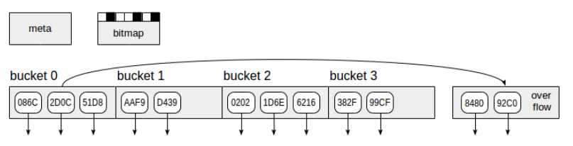

第一篇文章介绍了PostgreSQL索引引擎，第二篇文章介绍了访问方法的接口，现在我们准备讨论特定类型的索引。让我们从哈希（hash）索引开始。


# 基础理论

许多现代编程语言都将哈希（散列）表作为基础数据类型。在外部，哈希表看起来像一个常规数组，它使用任何数据类型（例如字符串）而不是整数进行索引。PostgreSQL中的哈希索引的结构与此类似。这是怎么工作的？

通常，数据类型的允许值范围非常大：在“文本”类型的列中，我们可以设想有多少不同的字符串？同时，在某个表的文本列中实际存储了多少不同的值？通常情况下，不是很多。


散列的思想是将一个小数字（从0到N−1，总共N个值）与任何数据类型的值相关联。这样的关联称为散列函数。所获得的数字可用作常规数组的索引，其中将存储对表行（TID）的引用。此数组的元素称为哈希表存储桶（bucket）-如果同一索引值出现在不同的行中，则一个存储桶可以存储多个TID。


哈希函数越是均匀地按桶分配源值，效果越好。但是，即使是一个好的散列函数有时也会为不同的源值产生相同的结果——这称为冲突。因此，一个存储桶可以存储对应于不同键的TID，因此需要重新检查从索引中获得的TID。


举例来说：我们可以想到字符串的哪些哈希函数？假设存储桶的数量为256。例如，对存储桶编号，我们可以取第一个字符的编码（假设是单字节字符编码）。这是一个好的散列函数吗？显然，不是这样的：如果所有的字符串都以同一个字符开头，那么所有的字符串都将进入一个bucket，因此一致性是不可能的，所有的值都需要重新检查，散列将没有任何意义。如果我们将所有以256为模的字符的编码相加呢？这会更好，但远不是理想的。如果您对PostgreSQL中这种散列函数的内部内容感兴趣，请查看hashfunc.c中hash_any()的定义。


# 索引结构

让我们回到哈希索引。对于某个数据类型（索引键）的值，我们的任务是快速找到匹配的TID。

当插入索引时，计算KEY的哈希值。PostgreSQL中的散列函数总是返回“integer”类型，该类型的值范围为2^32≈40亿。bucket的数量最初等于2，然后根据数据大小动态增加。桶号可以使用位算法从散列码中计算出来，这是我们将放置TID的存储桶。


但这还不够，因为匹配不同KEY值的TID可以放在同一个bucket中。我们该怎么办？除了TID之外，还可以将KEY值存储在bucket中，但这将大大增加索引大小。为了节省空间，存储桶存储了KEY值的哈希码，而不是KEY值。

在搜索索引时，我们通过哈希函数计算KEY值对应的桶号。现在，它仍然需要遍历存储桶的内容，并仅返回哈希码匹配的TID。因为存储的«hash code-TID»对是有序的，因此可以高效地完成这个遍历操作。


然而，两个不同的KEY值可能不仅会进入一个bucket，而且会有相同的四字节哈希码——没有人能够消除冲突。因此，访问方法要求通用索引引擎通过重新检查表行中的条件来验证每个TID（引擎可以与可见性检查一起执行此操作）。


# 数据结构到页面的映射

如果我们从缓冲区缓存管理器的角度而不是从查询计划和执行的角度来看索引，那么所有信息和所有索引行都必须打包到页面中。这样的索引页存储在缓冲区缓存中，并以与表页完全相同的方式从缓存那里被换出。


如图所示，哈希索引使用四种页面（灰色矩形）：



- Meta page — 第0页，其中包含有关索引中内容的信息。
- Bucket pages — 索引的主页面，将数据存储为“hash code-TID”对。
- Overflow pages — 结构与bucket页相同，当一个页不足以容纳bucket时使用。
- Bitmap pages — 它跟踪当前清除的溢出页，并可将其重新用于其他存储桶。


从索引页元素开始的向下箭头表示TID，即对表行的引用。

每次索引增加时，PostgreSQL都会立即创建两倍于上次创建的存储桶（因此也就是页面）为了避免一次分配大量潜在的页面，版本10使大小增加更加平滑。至于溢出页，它们在需要时分配，并在位图页中跟踪，位图页也在需要时分配。

**请注意**，哈希索引大小不能被减小。如果我们删除一些索引行，那么一旦分配了页，就不会返回到操作系统中，而只会在 VACUUMING 之后重新用于新数据。减少索引大小的唯一选项是使用 REINDEX 或 VACUUM FULL 命令从头重新生成索引。


**例**：

让我们看看哈希索引是如何创建的。为了避免设计自己的表，从现在起我们将使用航空运输的演示数据库，这次我们将考虑航班表。


```SQL
demo=# create index on flights using hash(flight_no);
WARNING:  hash indexes are not WAL-logged and their use is discouraged
CREATE INDEX

demo=# explain (costs off) select * from flights where flight_no = 'PG0001';
                     QUERY PLAN                     
----------------------------------------------------
 Bitmap Heap Scan on flights
   Recheck Cond: (flight_no = 'PG0001'::bpchar)
   ->  Bitmap Index Scan on flights_flight_no_idx
         Index Cond: (flight_no = 'PG0001'::bpchar)
(4 rows)
```
PostgreSQL10之前版本哈希索引的操作不会记录在WAL中（在创建索引时，PostgreSQL会发出警告）。因此，哈希索引在失败后无法恢复并且不参与流复制。此外，哈希索引的通用性远远低于B-树，其效率也值得怀疑。

不过，PostgreSQL10发布，哈希索引最终获得了对WAL的支持；此外，内存分配得到了优化，并发工作变得更加高效。因此可以不受限制地使用，该警告不再显示。

# 哈希含义

但是为什么PostgreSQL10之前，一直存在哈希索引几乎无法使用的问题？问题是DBMS广泛地使用了哈希算法（特别是对于哈希连接和分组），并且系统必须知道要对哪些数据类型应用哪个哈希函数。但是这种对应关系不是一成不变的，而且不能一劳永逸地设置它，因为PostgreSQL允许动态添加新的数据类型。这是一种通过哈希的访问方法，其中存储了此对应关系，即辅助函数与算子族的关联。

```SQL
demo=# select opf.opfname as opfamily_name,
         amproc.amproc::regproc AS opfamily_procedure
        from     pg_am am,
                 pg_opfamily opf,
                 pg_amproc amproc
        where    opf.opfmethod = am.oid
        and      amproc.amprocfamily = opf.oid
        and      am.amname = 'hash'
        order by opfamily_name,
                 opfamily_procedure;
   opfamily_name    | opfamily_procedure
--------------------+-------------------- 
 abstime_ops        | hashint4
 aclitem_ops        | hash_aclitem
 array_ops          | hash_array
 bool_ops           | hashchar
...
```

尽管未记录这些函数，但可以将它们用于为适当数据类型的值计算哈希码。例如，如果将«hashtext»函数用于«text_ops»运算符家族：

尽管这些函数没有文档记录，但它们可以用于计算适当数据类型值的哈希码。例如，«hashtext»函数如果用于«text_ops»运算符系列：

```SQL
demo=# select hashtext('one');
 hashtext  
-----------
 127722028
(1 row)

demo=# select hashtext('two');
 hashtext  
-----------
 345620034
(1 row)
```

# 性质

让我们看一下哈希索引的属性：

```SQL
postgres=# select a.amname, p.name, pg_indexam_has_property(a.oid,p.name)
            from pg_am a,
            unnest(array['can_order','can_unique','can_multi_col','can_exclude']) p(name)
            where a.amname = 'btree'
            order by a.amname;
 amname |     name      | pg_indexam_has_property
--------+---------------+-------------------------
 btree  | can_order     | t
 btree  | can_unique    | t
 btree  | can_multi_col | t
 btree  | can_exclude   | t
(4 rows)

postgres=# select p.name, pg_index_has_property('t_a_idx'::regclass,p.name)
           from unnest(array['clusterable','index_scan','bitmap_scan','backward_scan']) p(name);
     name      | pg_index_has_property
---------------+-----------------------
 clusterable   | t
 index_scan    | t
 bitmap_scan   | t
 backward_scan | t
(4 rows)

postgres=# select p.name, pg_index_column_has_property('t_a_idx'::regclass,1,p.name)
			from unnest(array[
			'asc','desc','nulls_first','nulls_last','orderable','distance_orderable',
			'returnable','search_array','search_nulls'
			]) p(name);
        name        | pg_index_column_has_property
--------------------+------------------------------
 asc                | t
 desc               | f
 nulls_first        | f
 nulls_last         | t
 orderable          | t
 distance_orderable | f
 returnable         | t
 search_array       | t
 search_nulls       | t
(9 rows)
```

哈希函数不保留顺序关系：如果一个KEY值小于另一个KEY值，哈希函数不可能对KEY本身的顺序作出任何结论。因此，一般来说，哈希索引只能支持«equals»操作

```SQL
demo=# select opf.opfname AS opfamily_name,
                 amop.amopopr::regoperator AS opfamily_operator
        from     pg_am am,
                 pg_opfamily opf,
                 pg_amop amop
        where    opf.opfmethod = am.oid
        and      amop.amopfamily = opf.oid
        and      am.amname = 'hash'
        order by opfamily_name,
                 opfamily_operator;
 opfamily_name |  opfamily_operator  
---------------+----------------------
 abstime_ops   | =(abstime,abstime)
 aclitem_ops   | =(aclitem,aclitem)
 array_ops     | =(anyarray,anyarray)
 bool_ops      | =(boolean,boolean)
...
```
因此，哈希索引不能返回有序数据（«can_order»，«orderable»）。出于这样的原因，哈希索引不能处理NULL：«equals»操作对NULL（«search_nulls»）没有意义。

由于哈希索引不存储键（仅存储其哈希码），因此它不能用于仅索引访问（“returnable”）。

此访问方法也不支持多列索引（«can_multi_col»）。


# 内部构造

从版本10开始，可以通过“ pageinspect ”扩展查看哈希索引内部。
```SQL
demo=# create extension pageinspect;
```

元页面（我们获取索引中的行数和已用的最大存储桶数）：
```SQL        
demo=# select hash_page_type(get_raw_page('flights_flight_no_idx',0));
 hash_page_type 
----------------
 metapage
(1 row)

demo=# select ntuples, maxbucket
        from hash_metapage_info(get_raw_page('flights_flight_no_idx',0));
 ntuples | maxbucket 
---------+-----------
   33121 |       127 
(1 row)
```
存储桶页面（获得活元组和死元组的数量）：
```SQL
demo=# select hash_page_type(get_raw_page('flights_flight_no_idx',1));
 hash_page_type
----------------
 bucket
(1 row)

demo=# select live_items, dead_items
        from hash_page_stats(get_raw_page('flights_flight_no_idx',1));
 live_items | dead_items
------------+------------
        407 |          0
(1 row)
```
但是，在不查看源代码的情况下几乎不可能找出所有可用字段的含义。如果希望这样做，则应从 [README](https://git.postgresql.org/gitweb/?p=postgresql.git;a=blob;f=src/backend/access/hash/README;hb=HEAD) 开始。

# 英文原文：
https://habr.com/en/company/postgrespro/blog/442776/