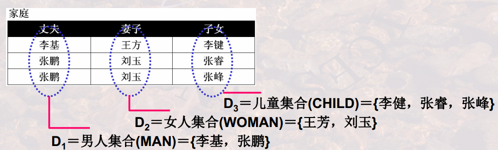
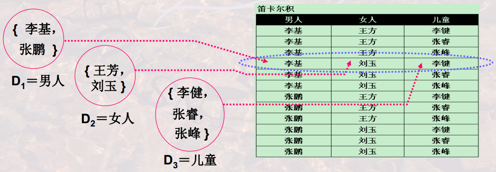
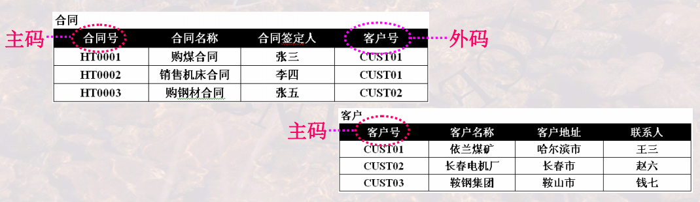
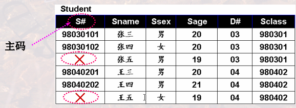
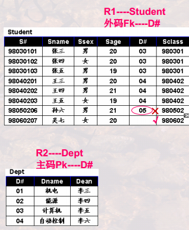
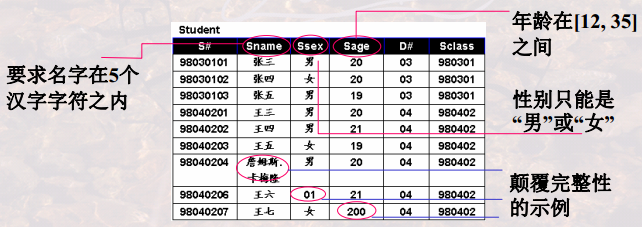

## 关系模型
### 三个要素
1. 基本结构： Relation/Table

2. 基本操作： Relation Operator

3. 完整性约束： 实体完整性、参照完整性和用户自定义的完整性

### 怎样严格定义一个“表” ?

### 域(Domain)
#### 首先定义“列”的取值范围“域(Domain)”

- 一组值的集合，这组值具有相同的数据类型
    - 如整数的集合、字符串的集合、全体学生的集合
    - 再如, 由8位数字组成的数字串的集合，由0到100组成的整数集合
- 集合中元素的个数称为域的基数(Cardinality)

### 笛卡尔积(Cartesian Product)
#### 再定义“元组”及所有可能组合成的元组：笛卡尔积

一组域D1 , D2 ,…, Dn的笛卡尔积为:
D1× D2× …× Dn = { (d1 , d2 , … , dn) | di∈ Di , i=1,…,n }

笛卡尔积的每个元素(d1 , d2 , … , dn)称作一个n-元组（ n-tuple）

- 元组(d1 , d2 , … , dn)的每一个值di叫做一个分量(component)
- 元组(d1 , d2 , … , dn)是从每一个域任取一个值所形成的一种组合，笛卡尔积是所有这种可能组合的集合， 即：笛卡尔积是由n个域形成的所有可能的n-元组的集合
- 若Di的基数为mi，则笛卡尔积的基数，即元组个数为
m1 * m2 * … * mn

**由于笛卡尔积中的所有元组并不都是有意义的，因此关系的概念出现了。**

关系(Relation)：
- 一组域D1 , D2 ,…, Dn的笛卡尔积的子集
- 笛卡尔积中具有某一方面意义的那些元组被称作一个关系(Relation)
- 由于关系的不同列可能来自同一个域，为区分，需要为每一列起一个名
字，该名字即为属性名。

- 关系可用R(A1:D1 , A2:D2 , … , An:Dn )表示，可简记为R(A1 , A2 , … ,
An )，这种描述又被称为关系模式(Schema)或表标题(head)
- R是关系的名字, Ai 是属性, Di 是属性所对应的域, n是关系的度或目
(degree), 关系中元组的数目称为关系的基数(Cardinality)
- 例如下图的关系为一3目关系，描述为
家庭(丈夫:男人，妻子:女人, 子女:儿童)或家庭(丈夫，妻子, 子女)
什么是关系?

关系模式R(A1:D1 , A2:D2 , … , An:Dn ) 中属性向域的映象在很多DBMS
中一般直接说明为属性的类型、长度等
例如：
- Student( S# char(8), Sname char(10), Ssex char(2),
- Sage integer, D# char(2), Sclass char(6) )
再如：
- Course ( C# char(3), Cname char(12), Chours integer,
Credit float(1), T# char(3) )
- SC( S# char(8), C# char(3), Grade float(1) )

#### 关系模式与关系
- 同一关系模式下，可有很多的关系
- 关系模式是关系的结构, 关系是关系模式在某一时刻的数据
- 关系模式是稳定的；而关系是某一时刻的值，是随时间可能变化的

**“表”和“关系”有什么异同?**
#### 关系的特性
- 列是同质： 即每一列中的分量来自同一域，是同一类型的数据
- 理论上， 关系的任意两个元组不能完全相同。(集合的要求：集合内不能有相同的两个元素)； 现实应用中， 表(Table)可能并不完全遵守此特性。
- 元组相同是指两个元组的每个分量都相同。
- 属性不可再分特性: 又被称为关系第一范式

### 候选码(Candidate Key)/候选键
- 关系中的一个属性组，其值能唯一标识一个元组，若从该属性组中去掉任何一个属性，它就不具有这一性质了，这样的属性组称作候选码。

例如： “学生(S#, Sname, Sage, Sclass)”， S#就是一个候选码，在此关系中，任何两个元组的S#是一定不同的，而这两个元组的Sname, Sage, Sclass都可能相同(同名、同龄、同班)，所以S#是候选码。

再如： “选课(S#, C#, Sname, Cname, Grade)”， (S#,C#)联合起来是一
个候选码

- 有时，关系中有很多组候选码，例如：

学生(S#, Sname, Sage, Sclass, Saddress)
其中属性S#是候选码，属性组(Sname, Saddress)也是候选码(同名同地
址的两个同学是不存在的)

再如
Employee(EmpID, EmpName, Mobile)
每一雇员有唯一的EmpID, 没有两个雇员有相同的手机号Mobile, 则
EmpID是候选码， Mobile也是候选码

### 主码(Primary Key)/主键
- 当有多个候选码时，可以选定一个作为主码。
- DBMS以主码为主要线索管理关系中的各个元组。

例如：可选定属性S#作为“学生”表的主码，也可以选定属性组(Sname,
Saddress)作为“学生”表的主码。选定EmpID为Employee的主码。

### 主属性与非主属性
- 包含在任何一个候选码中的属性被称作主属性， 而其他属性被称作非主属性

如 “选课”中的S# , C#为主属性，而Sname, Cname, Grade则为非
主属性；

最简单的，候选码只包含一个属性。

最极端的，所有属性构成这个关系的候选码，称为全码(All-Key)。

比如：关系“教师授课”(T#,C#)中的候选码(T#,C#)就是全码。

### 外码(Foreign Key)/外键
- 关系R中的一个属性组，它不是R的候选码，但它与另一个关系S的候选
码相对应，则称这个属性组为R的外码或外键。

例如“合同”关系中的客户号不是候选码，但却是外码。因它与“客户”关
系中的候选码“客户号” 相对应。

- 两个关系通常是靠外码连接起来的。

### 关系模型中的完整性
#### 实体完整性
- 关系的主码中的属性值不能为空值；

**空值的含义**
- 空值：不知道、不存在或无意义的值；
- 在进行关系操作时，有时关系中的某属性值在当前是填不上的，比
如档案中有“生日不详”、 “下落不明”、 “日程尚待公布”等，这时就需要
空值来代表这种情况。关系模型中用‘?’表征
- 数据库中有了空值，会影响许多方面，如影响聚集函数运算的正确性，不能参与算术、比较或逻辑运算等

例如： “3 + ?”结果是多少呢？ “3 * ?”结果是多少呢？ “? and (A=A)”结果又是多少呢？

再例如，一个班有30名同学，如所有同学都有成绩，则可求出平均成绩；如果有一个同学没有成绩，怎样参与平均成绩的计算呢，是当作0，还是当作100呢？还是不考虑他呢？

- 有空值的时候是需要特殊处理的，要特别注意。

意义：关系中的元组对应到现实世界相互之间可区分的一个个个
体，这些个体是通过主码来唯一标识的；若主码为空，则出现不可标识
的个体，这是不容许的。

#### 参照完整性
- 如果关系R1的外码Fk与关系R2的主 码Pk相对应，则R1中的每一个元组的 Fk值或者等于R2 中某个元组的Pk 值， 或者为空值

- 意义：如果关系R1的某个元组t1参照 了关系R2的某个元组t2，则t2必须存在 

例如关系Student在D#上的取值有两 种可能: 
- 空值，表示该学生尚未分到任何系中 
- 若非空值，则必须是Dept关系中某个 元组的D#值，表示该学生不可能分到一 个不存在的系中

#### 用户自定义完整性
- 用户针对具体的应用环境定义的完整性约束条件

如S#要求是10位整数，其中前四位为年度，当前年度与他们的
差必须在4以内

再如：

DBMS对关系完整性的支持
- 实体完整性和参照完整性由DBMS系统自动支持
- DBMS系统通常提供了如下机制：

(1)它使用户可以自行定义有关的完整性约束条件

(2)当有更新操作发生时， DBMS将自动按照完整性约束条件检验更新操
作的正确性，即是否符合用户自定义的完整性

