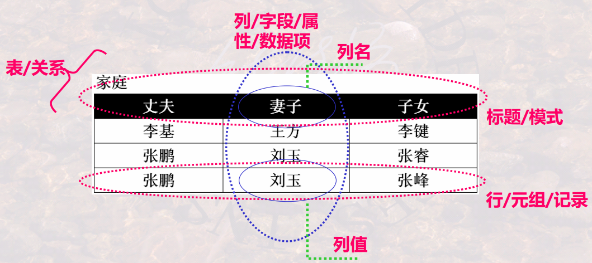

## 关系模型的三个要素
1. 基本结构： Relation/Table
2. 基本操作： Relation Operator
基本的： (并, UNION)、 (差, DIFFERENCE) 、 (广义积,
PRODUCT)、 (选择, SELECTION)、 (投影, PROJECTION)。
扩展的: (交, INTERSECTION) 、 (连接, JOIN)、
(除, DIVISION)运算
3. 完整性约束： 实体完整性、 参照完整性和用户自定义的完整性

为什么把“表”称为关系?

怎样严格定义一个“表” ?

“表”和“关系”有什么异同?
