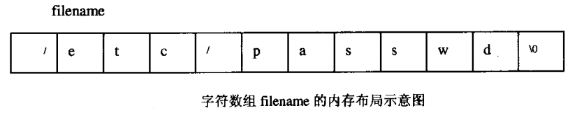
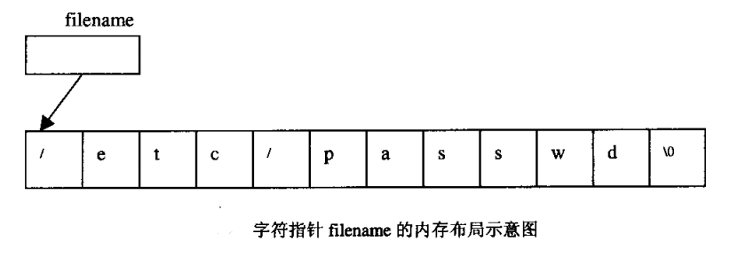

# 字符串指针和字符串数组

char *a="KING-ERIC" 与 char a[]="KING-ERIC"的区别：

1、字符串存放的内存区域不同：前者存放在常量区，不可修改，后则存放在栈中，可以修改；

2、变量 a 存放的内容不同：前者存放的是一个地址，而后者存放的是字符串 "abcdef" ，因此使用 sizeof 它们的结果是不同的，分别是 4 和 10；


# 函数参数为数组

将数组作为参数传到函数里，C语言会自动的将作为参数的数组声明转换成相应的指针声明，所以在传数组的时候只需要写数组名，不需要写大小


```C
int strlen(char s[]) 等同于 
int strlen(char *s) //都是将首地址传了进去
```


# extern数组与extern指针

考虑下面的程序，在一个文件中包含定义：
```C
char filename[] = "/etc/passwd";
```

而在另一个文件中包含声明：

```C
extern char*filename;
```

尽管在某些上下文环境中，数组与指针非常类似，但它们毕竟不同。在第一个声明中，filename是一个字符数组的名称。尽管在一个语句中引用filename的值将得到指向该数组起始元素的指针，但是filename的类型是“字符数组”，而不是“字符指针”。在第二个声明中，filename被确定为一个指针。这两个对filename的声明使用存储空间的方式是不同的；它们无法以一种合乎情理的方式共存。

第一个例子中字符数组filename的内存布局大致如图所示。



第二个例子中字符指针filename的内存布局大致如图所示。



更正的方法是，改变filename的声明或定义，使其与另一个类型匹配。
改法如下：

```C
char filename[]="/etc/passwd"; /*文件1*/
extern char filename[]; /*文件2*/
```

也可以是这种改法：

```C
char *filename="/etc/passwd"; /*文件1*/
extern char *filename; /*文件2*/
```
